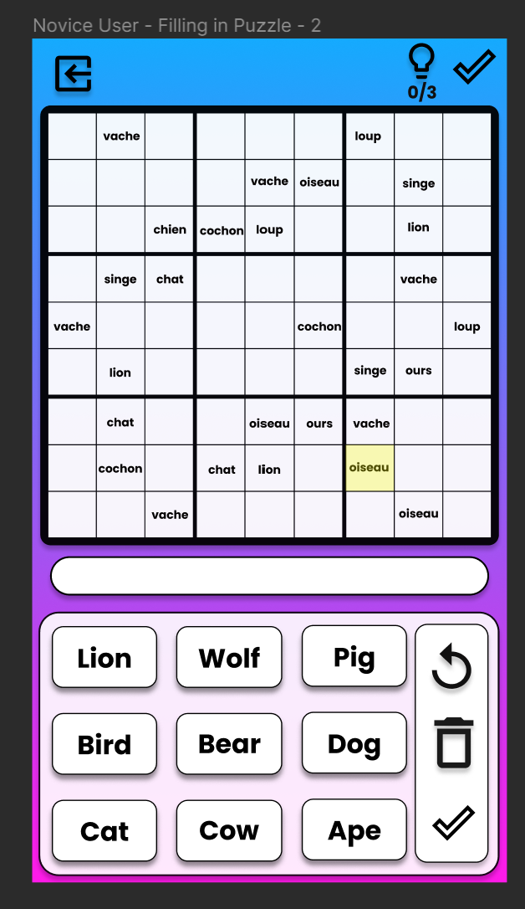
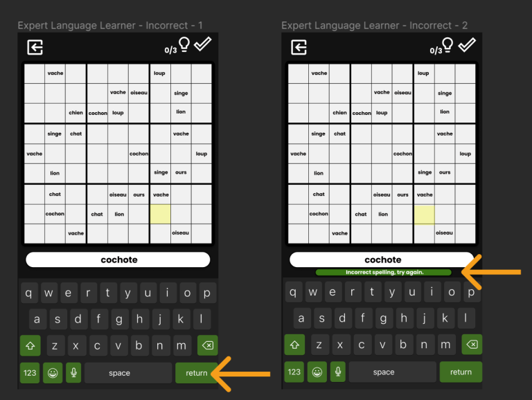

# **CMPT276-1231-D2-xray**

### User Story: 
### Novice User
As a novice user I want to have a clickable word bank to tap the words in one language and fill them in the puzzle with the other language so that I can easily fill in the puzzle on a mobile device.

### TDD Examples:
When playing the game, there will be 9 buttons under the sudoku puzzle each with one word. When the user wants to change their answer in a cell, the user clicks on that cell and then click on another word in the word bank. If the user wants to remove an answer in a cell, they click on that cell and then click on the trash icon next to the word bank to clear the word from that cell.

<!-- 
 -->

#

### User Story: 
### Novice User
As a novice user, I want to be able to check my puzzle solving progress so that I can get feedback on certain words and improve my Sudoku-solving ability. 

### TDD Examples:
At any point in your game, you can click on a cell with an answer filled in and click the lightbulb on the top right corner. The game will check that cell and then highlight red if the answer is wrong or green if the answer is correct. The user can use this 3 times.

<!-- 
 -->

 
At any point in the game, you can finish the puzzle by pressing the checkmark icon in the top right corner or by filling all the cells in with words. The program will take you to the main menu page, and display your percentage of correct answers in a toast, prompting you to try another puzzle.

#

### User Story: 
### Expert User
As an expert user, I want the option to solve more difficult sudoku puzzles so that I can challenge my problem thinking skills without raising the difficulty of words.

### TDD Examples:
The user opens the application and clicks the enter game button from the main menu. After, they are prompted with a menu screen that has preset categories of basic vocabularies (ex. numbers, pronouns, foods, animals etc.) in which the user can select their desired category to play the game in. After that, the user can select their word difficulty and select “hard” for the puzzle difficulty. If choices aren’t made for all three options, a toast will pop up encouraging the user to do so, and will not generate a puzzle until doing so.

<!-- 
 -->

#

### User Story: 
### Beginner Language Learner
As a beginner language learner I want to choose pre-set word lists to expose myself to the new language so that I can be introduced to common related words.

### TDD Examples:
When the user clicks to enter a game from the main menu, they can select the "Easy" difficulty by clicking a button which will display several preset categories of basic vocabularies (ex. numbers, pronouns, foods, animals etc.) in which the user can choose by clicking a button that is corresponding to the categories.

When a user double taps a filled in cell on the Sudoku game board, a toast of the translation of the word in that cell in the opposing language will be displayed in the space under the board.

<!-- 
 -->

#

### User Story:
### Intermediate Language Learner
As an intermediate language learner, I want to be able to have puzzles made from randomized pre-existing word lists so that I can practice thinking in the language I’m learning and therefore strengthen my knowledge of these words.

### TDD Examples:
When the user clicks to enter a game from the main menu, they can select the "Normal" difficulty by clicking a button which will generate a puzzle with a word bank that consists of vocabularies that are randomly chosen and mixed from the categories available in the "Easy" difficulty.

<!-- 
 -->

#

### User Story:
### Expert Language Learner
As an expert language learner, I want to be able to solve Sudoku puzzles without a word bank and type the words in French so that I can push my French knowledge even further by remembering their spelling.

### TDD Examples:
When a user is generating a new puzzle and selects “Hard” difficulty from the language difficulty setting, all nine words will be on the puzzle at least once and the user will add words to the puzzle by typing them in the other language.

For example, when the user selects a Sudoku square to add a word, a typing box with keyboard pops up to type the word in French, which will not accept the response unless it’s properly spelled and the correct translation to one of the nine English words in the word bank. When the user is finished typing a word, it will fill the Sudoku square with the English word. If the word is spelled incorrectly or not a match, a toast will pop up encouraging the user to retry/re-spell the word.

<!-- 

 -->

#

### User Story:
### Language Teacher
As a language teacher I want my students to be able to choose different language modes to select between English and French to pick words and fill in the puzzle so that my language students can interact with the French language in different dynamic ways that suit their preferences.

### TDD Examples:
When a user is generating a new puzzle, they can choose between two buttons “English/French” for the “Language Mode”, which will be the language for the word bank. If a user selects “English” for “Language Mode”, the word bank will contain English words for beginner and intermediate language levels; advanced doesn’t have a word bank. The user will tap on / type an English word then tap a Sudoku square to insert a word, which will be displayed in French.

<!-- 

 -->

#
